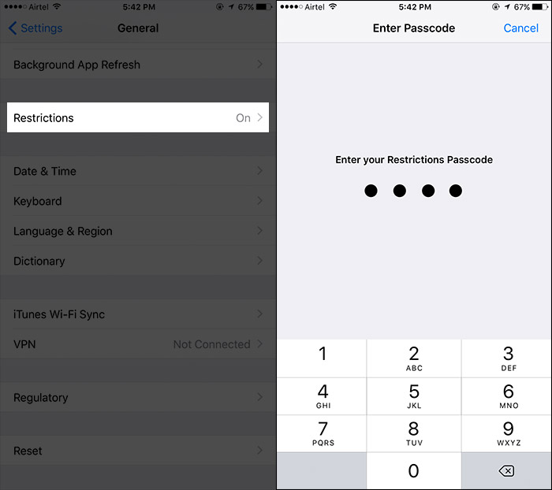
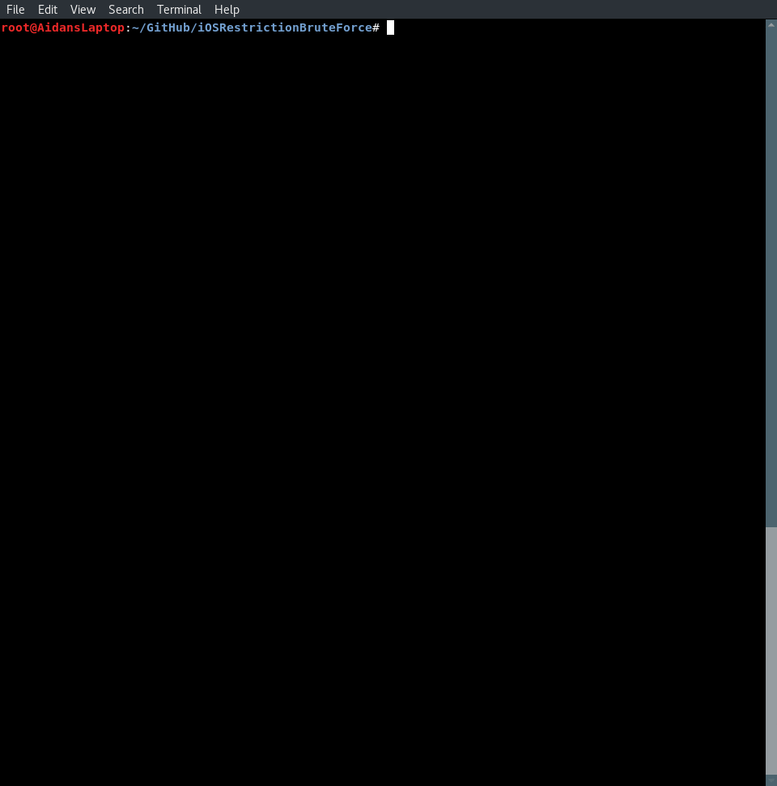

# iOS Restriction Passcode Brute Force 
[](https://www.python.org/downloads/release/python-2714/)  

## Overview

This version of the application is written in Python, which is used to crack the restriction passcode of an iPhone/iPad takes advantage of a flaw in unencrypted backups allowing the hash and salt to be discovered.



## DEPENDENCIES

This has been tested with [Python 2.7](https://www.python.org/downloads/release/python-2714/)

Requires [Passlib](https://passlib.readthedocs.io/en/stable/) Install with `pip install passlib`

## How to Use

1. Clone repository

    `git clone https://github.com/thehappydinoa/iOSRestrictionBruteForce && cd iOSRestrictionBruteForce`

2. Make sure to use [iTunes](https://www.apple.com/itunes/download/) or [libimobiledevice](https://github.com/libimobiledevice/libimobiledevice) to backup the iOS device to computer

3. Run `ioscrack.py` with automatic hash discovery option

    `python ioscrack.py -a`
  
4. If ioscrack couldn't find your back up please try to [find it manually](https://github.com/thehappydinoa/iOSRestrictionBruteForce/wiki/Manually-find-restrictions-hash-and-salt) then run `ioscrack.py` with interactive hash input option

    `python ioscrack.py -i`



## Usage

```bash
usage: ioscrack.py [-h] [-v] [-a] [-i] [-b folder]

a script which is used to crack the restriction passcode of an iPhone/iPad
through a flaw in unencrypted backups allowing the hash and salt to be
discovered

optional arguments:
  -h, --help            show this help message and exit
  -v, --verbose         increase output verbosity
  -a, --automatically   automatically finds and cracks hashes
  -i, --interactive     prompts user for input
  -b folder, --backup folder
                        where backups are located
```

## How It Works

Done by using the pbkdf2-hmac-sha1 hash with the Passlib python module

1. Trys the [top 20 four-digit](http://www.datagenetics.com/blog/september32012/index.html) pins

2. Trys birthdays between 1900-2017

3. Brute force pins from 1 to 9999

## LICENSE

MIT License
